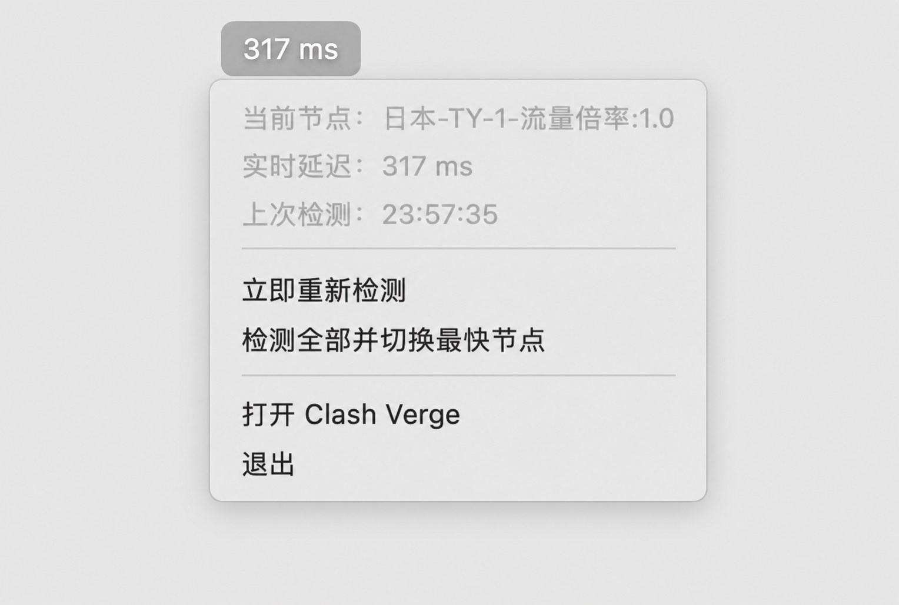

# ClashPulse

一键检测 Clash/Mihomo 节点延迟，按名称过滤候选节点，并自动切换到延迟最低的节点。无需打开 Clash Dashboard 手动刷新和选择。

## 核心功能

- 一条命令完成节点测速与自动切换
- 支持节点名称关键字和正则表达式过滤
- 支持排除测试、过期或特定类型节点
- 自动忽略超时和不可达节点
- 支持最大延迟限制
- 支持只测速不切换的 `dry-run`
- 支持定时自动检测
- 直接调用 Clash/Mihomo External Controller API，不依赖界面自动化

## 工作方式

1. 通过 `GET /proxies` 获取代理分组及其节点。
2. 按 `filter` 和 `exclude` 筛选候选节点。
3. 优先调用 Mihomo 分组延迟检测接口；不可用时并行检测每个候选节点。
4. 按延迟排序，忽略失败或超过 `maxDelay` 的节点。
5. 通过 `PUT /proxies/:group` 将 Selector 切换到最低延迟节点。

## 环境要求

- Node.js 18 或更高版本
- Clash/Mihomo 已启用 External Controller API
- 菜单栏可视化仅支持 macOS 13 或更高版本

## 安装

```bash
git clone https://github.com/zhuzzz/clash-pulse.git
cd clash-pulse
cp config.example.json config.json
```

编辑本机 `config.json`：

```json
{
  "controller": "http://127.0.0.1:9090",
  "secret": "",
  "group": "Proxy",
  "filter": "日本|JP|Japan",
  "exclude": "",
  "testUrl": "http://www.gstatic.com/generate_204",
  "timeout": 5000,
  "maxDelay": 0,
  "watchInterval": 300,
  "allowInsecureRemote": false
}
```

## 一键检测并切换

```bash
node index.js
```

示例输出：

```text
355 ms  日本-OS-1-流量倍率:1.0
654 ms  日本-TY-4-流量倍率:1.0
779 ms  日本-TY-1-流量倍率:1.0

✓ Selected 日本-OS-1-流量倍率:1.0 (355 ms)
```

### 常用命令

```bash
# 只检测并报告最快节点，不执行切换
node index.js --dry-run

# 使用普通名称关键字
node index.js --group Proxy --keyword "日本"

# 使用正则表达式包含多个地区，并排除测试节点
node index.js --group Proxy --filter "日本|JP|新加坡|SG" --exclude "TEST|过期"

# 每隔 watchInterval 秒重新检测并切换
node index.js --watch
```

也可以安装为全局命令：

```bash
npm link
clash-pulse --keyword "日本"
```

配置优先级：`config.json` < 环境变量 < CLI 参数。

支持的环境变量：

- `CLASH_CONTROLLER`
- `CLASH_SECRET`
- `CLASH_GROUP`
- `CLASH_FILTER`

密钥建议保存在已被 Git 忽略的 `config.json` 中，不要作为 CLI 参数传递，避免进入 shell 历史和进程列表。

## 配置说明

| 配置项 | 说明 |
| --- | --- |
| `controller` | Clash/Mihomo External Controller 地址 |
| `secret` | Controller API 密钥；没有密钥时留空 |
| `group` | 需要控制的 Selector 分组名称 |
| `filter` | 节点名称包含规则，支持正则表达式 |
| `exclude` | 节点名称排除规则，支持正则表达式 |
| `testUrl` | 延迟检测使用的目标地址 |
| `timeout` | 单个节点检测超时，单位毫秒 |
| `maxDelay` | 最大可接受延迟；`0` 表示不限制 |
| `watchInterval` | `--watch` 模式的检测间隔，单位秒 |
| `allowInsecureRemote` | 是否允许通过 HTTP 连接非本机 Controller |

`config.json` 可能包含密钥，已被 Git 忽略。公开仓库中只提交 `config.example.json`。远程 Controller 建议使用 HTTPS。

## macOS 菜单栏可视化（可选）

菜单栏插件是核心切换功能的可选可视化界面，用于随时查看当前节点和最近一次延迟。它不会取代一键测速切换逻辑。



它提供：

- 每 10 秒检测一次当前节点并更新延迟显示
- “立即重新检测”当前节点
- 执行相同的候选节点检测与最快节点切换流程
- 显示当前节点名称和上次检测时间

安装并启动：

```bash
./macos/install-app.sh
open "$HOME/Applications/ClashPulse.app"
```

菜单栏插件需要 Xcode Command Line Tools。修改 `config.json` 后，需要重新执行安装脚本并重启插件。

## 测试

```bash
npm test
```

## License

[MIT](LICENSE)
